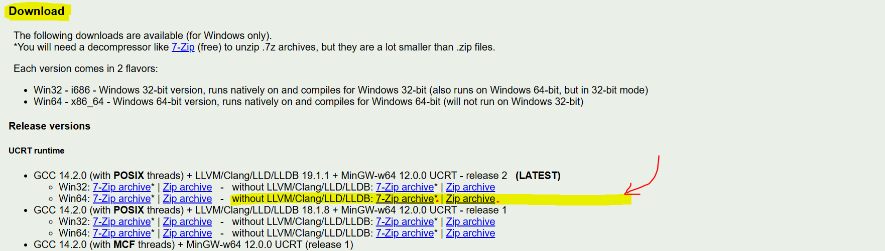

# Brain-Up (Puzzle Game)

This game is a clone of a mode within a real game called [Brain Up](https://www.amazon.ca/Rationalcell-Brain-Up/dp/B00B2BSF12), made with the C language and the SDL library. 🧠🎮

## How to Play the Game
___Please watch these 2 short videos:___ **[1st Mode Tutorial](./tutorials/1st_Mode.mp4)** | **[3rd Mode Tutorial](./tutorials/3rd_Mode.mp4)** 📹


## Prerequisites 📝

- ### Microsoft Windows 🖥️
This project has been proven to work on Windows x64. 

- ### GCC (C and C++ compiler for Microsoft Windows) 🛠️

If you already have GCC installed, you can skip this step. If you're not sure, try running:
```sh
gcc --version
```
If it gives an error like:
```
'gcc' is not recognized as an internal or external command, operable program or batch file.
```
it's probably because you either don't have it installed on your machine or it's not yet set as an environment variable.

In both cases, you can follow the next 2 steps:

#### 📥  **Download GCC Compiler** 
- Go to [winlibs.com](http://winlibs.com).
- Scroll down to "Download".
- Pick the latest version available for Win64 - without LLVM/Clang/LLD/LLDB.
 

#### ⚙️ **Add GCC (bin) to your PATH system variable:**
- Open the Start Menu and search for "Environment Variables".
- Click on "Edit the system environment variables".
- In the System Properties window, click on the "Environment Variables" button.
- In the Environment Variables window, find the "Path" variable in the "System variables" section and select it.
- Click on "Edit".
- In the Edit Environment Variable window, click on "New" and add the path to the GCC `bin` directory (e.g., `C:\path\to\mingw64\bin`).
- Click "OK" to close all windows.

## 🎮 Run the Game 
-  **Download or Clone the Repository:**
    - Open any command line (Cmd, PowerShell, Git Bash) and navigate to the downloaded repository.
    You can do so by running the command:
    ```sh
    cd directory-path
    ```
    Example:
    ```sh
    cd C:\Users\user\Desktop\Brain-Up-master.zip
    ```
    Or if you have Git installed:
    ```sh
    git clone https://github.com/mohBgz/Brain-Up.git
    ```
    and navigate to that cloned directory.

- **Compile and Run the Game:**
    
    ___Within that directory, follow these easy steps to launch the game:___

    - Compile the game by typing the following command:
    ```sh
    gcc src/main.c src/ProjetFonctions.c -o bin/prog -I src/include/SDL -I src/include -L src/lib -lmingw32 -lSDL2main -lSDL2 -lSDL2_image -lSDL2_ttf -lSDL2_mixer
    ```

    - If there are no errors, start the game by typing:
    ```sh
    .\bin\prog.exe
    ```

    **Enjoy the game!😉🎉**
